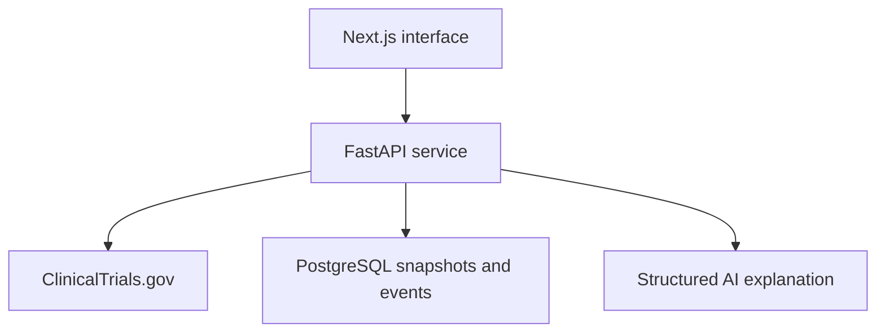

# Clinical Trial Monitoring Workspace — Algosoup Build Specification

## Mission

Build and deploy an end-to-end clinical-trial monitoring workspace.

The application monitors selected pharmaceutical sponsors through the ClinicalTrials.gov v2 API, identifies meaningful study changes, explains why they may matter, and proposes analyst follow-up actions for human approval.

The submission must demonstrate:

- Strong product judgement through a narrow, valuable workflow
- Simple, maintainable engineering
- Thoughtful use and supervision of a coding agent
- A complete live user journey
- Honest handling of uncertainty and source limitations

## Product definition

### Target user

A pharmaceutical competitive-intelligence analyst who currently checks public trial records manually.

### Job to be done

When a monitored clinical-trial record changes, show me exactly what changed, explain its possible significance, and help me start the appropriate follow-up.

### Core demonstration

1. Open an AstraZeneca watchlist.
2. View trial changes ordered by importance.
3. Open a change involving status, enrolment, dates, outcomes, or locations.
4. Inspect exact before-and-after evidence.
5. Read a concise AI-generated explanation grounded in that evidence.
6. Approve or reject a proposed analyst follow-up.
7. See the decision recorded in an audit timeline.

### Product boundary

The application is decision-support software. It must not claim to predict clinical success, safety, efficacy, regulatory approval, or commercial impact.

## Data source

Use the official ClinicalTrials.gov v2 API:

```http
GET https://clinicaltrials.gov/api/v2/studies
    ?query.spons=AstraZeneca
    &pageSize=10
    &sort=LastUpdatePostDate:desc
    &format=json
```

Handle:

- `nextPageToken` pagination where relevant
- Timeouts and non-success responses
- Missing optional modules and fields
- Loading, empty, and error states

ClinicalTrials.gov exposes the current study record. The application creates change history by storing or supplying a previous snapshot and comparing it with the current version.

For a reliable interview demonstration, include a clearly labelled replay scenario containing an older fixture and a newer fixture. The live watchlist must still use genuine API data.

## Monitored fields

Limit change detection to:

- Overall recruitment status
- Reason stopped
- Phase
- Enrolment count
- Primary-completion and completion dates
- Interventions
- Primary outcomes
- Eligibility criteria
- Countries and trial locations

## Severity rules

Severity must be deterministic. AI may explain a result but must not decide whether the underlying change happened.

| Change | Severity |
| --- | --- |
| Recruiting to terminated, withdrawn, or suspended | Critical |
| Reason stopped added or changed | Critical |
| Primary outcome or intervention changed | High |
| Primary-completion date materially delayed | High |
| Enrolment materially reduced | High |
| Country added or removed | Medium |
| Location added or removed | Medium |
| Descriptive change without operational effect | Low |

Keep thresholds as named constants covered by tests.

## Technical stack

Use a small monorepo and pin compatible stable versions.

| Layer | Technology |
| --- | --- |
| Backend | Python, FastAPI, Pydantic v2, HTTPX |
| Persistence | PostgreSQL, SQLAlchemy 2, Alembic, Psycopg 3 |
| Python tooling | uv, Ruff, Pytest, respx |
| Frontend | Next.js, React, TypeScript strict mode |
| UI | Tailwind CSS, shadcn/ui |
| Server state | TanStack Query |
| Contract | FastAPI OpenAPI to generated TypeScript types |
| AI | Direct model SDK with Pydantic-validated structured output |
| E2E test | Playwright |
| Deployment | Vercel for web; a container host for API; managed Postgres |

Do not introduce Redis, Celery, Kafka, Kubernetes, a vector database, RAG, multiple agents, or elaborate authentication.

## Architecture



## Minimal data model

### `studies`

- `id`
- `nct_id` — unique
- `title`
- `sponsor`
- `overall_status`
- `last_source_update`
- `raw_current` — JSONB

### `study_snapshots`

- `id`
- `study_id`
- `retrieved_at`
- `content_hash`
- `normalised_data` — JSONB
- `raw_data` — JSONB

Unique constraint: `(study_id, content_hash)`.

### `change_events`

- `id`
- `study_id`
- `severity`
- `category`
- `structured_diff` — JSONB
- `ai_analysis` — JSONB, nullable
- `review_status`
- `created_at`

### `follow_up_actions`

- `id`
- `change_event_id`
- `title`
- `status`
- `created_at`

## Application endpoints

```http
GET    /health
GET    /api/studies
POST   /api/sync
GET    /api/changes
GET    /api/changes/{id}
POST   /api/changes/{id}/actions
PATCH  /api/actions/{id}
```

## Processing pipeline

```text
fetch → validate → normalise → canonicalise → hash → persist
      → semantic diff → deterministic severity → AI explanation
      → proposed follow-up
```

If the model request fails, the event and its deterministic evidence must remain usable.

## Four-stage implementation plan

Treat these as capability milestones rather than timeboxes. Complete and verify each stage before moving to the next.

### Stage 1 — Foundation and live data

#### Build

- Scaffold the FastAPI and Next.js applications.
- Configure environment variables and dependency locks.
- Implement the ClinicalTrials.gov client.
- Normalise source records into a small typed Trial model.
- Expose `GET /api/studies`.
- Render an AstraZeneca study list with loading and error states.
- Commit once the live vertical slice works.

#### Acceptance criteria

- The browser displays genuine AstraZeneca studies through the Python backend.
- The frontend does not call ClinicalTrials.gov directly.
- Upstream failures produce a useful error response and interface state.

#### Agent teaching instruction

Before coding, explain the request flow, source response structure, backend boundary, and chosen folder structure. After coding, identify the files responsible for each step and ask me to explain the flow back.

### Stage 2 — Change-detection core

#### Build

- Add the minimal database schema.
- Store current and previous normalised snapshots.
- Canonicalise and hash snapshots for idempotency.
- Implement semantic diffs for the monitored fields.
- Implement deterministic severity rules.
- Add one labelled replay scenario guaranteed to generate a meaningful event.
- Expose the change inbox and detail endpoints.
- Test one critical change and one unchanged repeat sync.

Fix Stage 1 bugs found in review, each test-first:

- Bug 1 — when every fetched study is skipped, the watchlist says "No studies found for AstraZeneca as lead sponsor." and hides the skipped count. `StudyTable` in `web/src/app/page.tsx` returns the empty message before the skipped note. Expected: the skipped note shows; the empty message appears only when nothing was fetched.
- Bug 2 — a malformed study that is not a dict (or whose `protocolSection` or a nested module is not a dict) raises `AttributeError`/`TypeError` in `normalise_studies` (`api/src/monitor/clinicaltrials.py`), including in its logging line, so `GET /api/studies` returns 500. Expected: the study is skipped, logged and counted like any other invalid study. Also rename the misleading `nct_id` variable there, which holds the identification module.

#### Acceptance criteria

- Repeating an unchanged sync creates no duplicate event.
- A recruiting-to-terminated replay creates a critical event.
- Every event contains exact before-and-after evidence.
- The rules work without an LLM.

#### Agent teaching instruction

Explain snapshotting, canonicalisation, hashes, idempotency, semantic versus raw JSON diffs, and why severity must be deterministic. Present alternatives briefly before choosing the smallest adequate implementation.

### Stage 3 — Complete analyst workflow

#### Build

- Create a prioritised change inbox.
- Create a change-detail page with before/after evidence.
- Add one structured AI explanation generated only from explicit evidence.
- Propose two or three follow-up actions.
- Add approve and reject interactions.
- Record the user's decision in a compact audit timeline.
- Handle model timeout/failure without breaking the workflow.

#### Acceptance criteria

- The main flow is understandable without instructions.
- Facts and AI interpretation are visually distinct.
- AI cannot change the diff or severity.
- No action becomes approved without a user interaction.
- The complete demo flow takes less than two minutes.

#### Agent teaching instruction

Explain structured model outputs, grounding, failure handling, state transitions, and the boundary between deterministic logic and generative AI. Show where hallucinations are prevented and where risk remains.

### Stage 4 — Verify, deploy, and submit

#### Build and verify

- Run backend unit tests and frontend checks.
- Add a Playwright happy-path test.
- Test live and replay modes in the deployed application.
- Verify responsive layout and basic keyboard accessibility.
- Add source links, data timestamps, and prototype disclaimers.
- Deploy the frontend and backend.
- Complete the README and submission checklist.

#### Acceptance criteria

- The deployed URLs work in a clean browser session.
- The replay mode is clearly labelled and cannot be mistaken for a live event.
- The repository contains reproducible local setup instructions.
- The README describes architecture, trade-offs, limitations, and tests.
- The full coding-agent log remains unedited.

#### Agent teaching instruction

Explain every failed check and the chosen fix. End with a concise walkthrough of the architecture, trade-offs, edge cases, known limitations, and the questions I should be prepared to answer in the interview.

## UI requirements

The interface needs only three views:

- Study watchlist — live studies, sponsor, phase, status, last update.
- Change inbox — severity, headline, study, timestamp, review state.
- Change detail — evidence, qualified explanation, proposed actions, audit timeline.

Prefer a clean information-dense workspace over a decorative marketing page. Use colour as a secondary severity signal, never as the only signal.

## AI output contract

Require structured output similar to:

```json
{
  "headline": "Study status changed to terminated",
  "summary": "The study moved from recruiting to terminated.",
  "possible_significance": [
    "The programme may require analyst review."
  ],
  "recommended_actions": [
    "Review other studies involving the same intervention",
    "Assign the change to the relevant pipeline analyst"
  ],
  "confidence": "high"
}
```

The prompt must prohibit medical conclusions, causal claims, predictions, and unsupported company assertions.

## Tests to prioritise

- ClinicalTrials.gov payload normalisation with missing optional fields.
- Recruiting to terminated produces critical severity.
- Unchanged records produce no event.
- Duplicate sync is idempotent.
- AI failure still returns deterministic evidence.
- Approving an action creates an audit entry.

## README requirements

Include:

- Product problem and target user
- Screenshots or short GIF if available
- Architecture and data flow
- Local setup commands
- Environment variables
- Test commands
- Deployment URLs
- Product and engineering trade-offs
- Data-source and AI limitations
- Delivered scope and deliberately omitted features

Do not imply access to AstraZeneca systems or endorsement by AstraZeneca.

## Submission checklist

- Public GitHub repository URL
- Live frontend URL
- Working backend/API deployment
- Unedited coding-agent transcript or export
- README with setup, architecture, trade-offs, and limitations
- Replay data visibly labelled
- Secrets absent from repository and logs
- Final clean-browser smoke test completed

## Coding-agent operating instructions

For every stage:

- Inspect the repository before editing.
- State the stage objective, assumptions, and test plan.
- Teach the relevant design concepts concisely before implementing them.
- Prefer the smallest design that satisfies the acceptance criteria.
- Make reviewable changes and inspect generated code.
- Run the narrowest useful checks after each increment.
- Surface uncertainty, failures, and scope pressure immediately.
- Do not add infrastructure or features outside this specification.
- End each stage with changed files, commands run, evidence, limitations, and what I should be able to explain.
- Preserve the complete unedited agent log.

## Definition of done

A reviewer can open the live product, inspect a genuine clinical-trial watchlist, run or view a clearly labelled change replay, understand the exact source evidence, review a qualified AI explanation, approve a follow-up action, and see the decision recorded. The repository is simple, deployable, and tested around its highest-risk logic.
